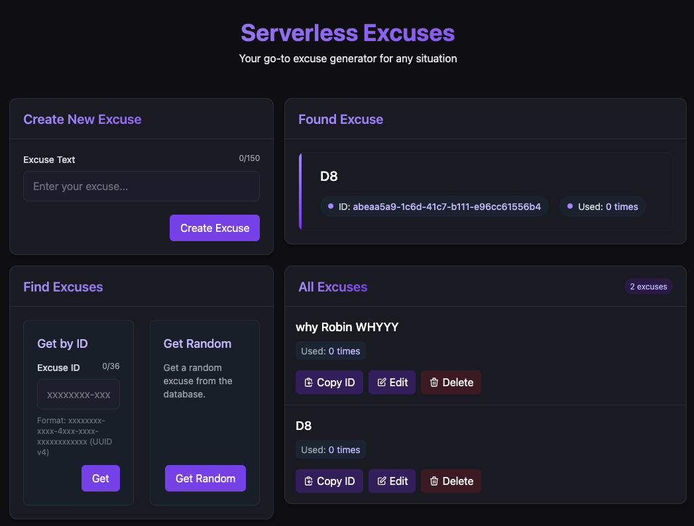

# Serverless Excuses Frontend

A sleek, one-page frontend built with React + TypeScript + Tailwind CSS v4 to interface with the Serverless Excuses API.

This app allows users to:

- View a random excuse
- Browse all excuses
- Create new excuses
- Update or delete existing ones

Deployed as an Azure Static Web App and communicates securely with a serverless backend hosted on Azure Functions and
Cosmos DB.

## Prerequisites

- .env file with the following variables:

```env
VITE_BASE_API_URL=https://<your-function-app>.azurewebsites.net/api
VITE_FUNCTION_KEY=<your-function-key>
```

## Deployment (CI/CD)

Deployment is handled via GitHub Actions using the Azure Static Web Apps deploy action.

### Required GitHub Secrets:

- `AZURE_STATIC_WEB_APPS_API_TOKEN` – from `az staticwebapp secrets list`
- `VITE_BASE_API_URL` – your backend URL (output from Terraform)
- `VITE_FUNCTION_KEY` – from Azure Portal → Function App → Keys → default

## Production Hosting

Hosted on [Azure Static Web Apps](https://learn.microsoft.com/en-us/azure/static-web-apps/overview).

Backend CORS is automatically configured to allow this app's domain via Terraform.

## Preview


